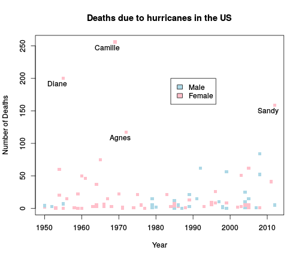
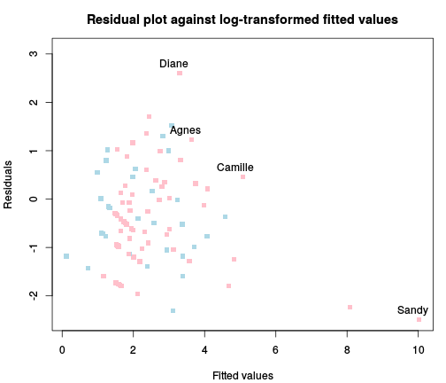
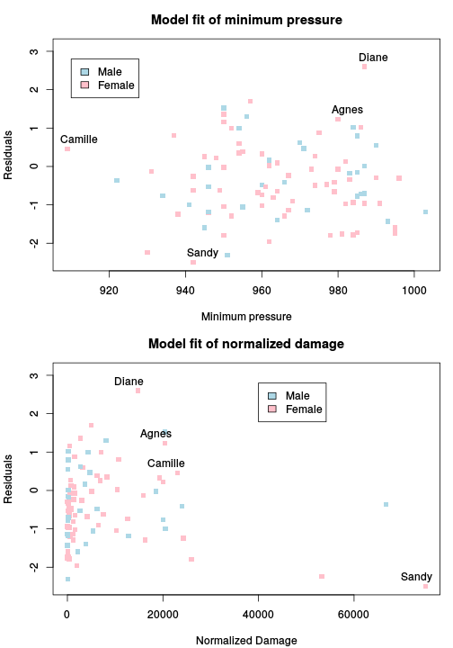
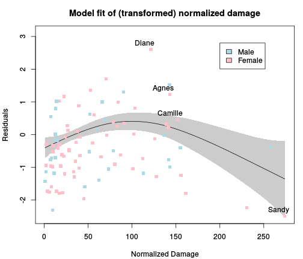
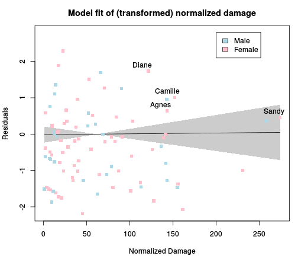
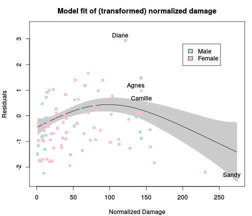

Hurricanes: the female of the species in no more deadly than the male
========================================================

This is a re-analysis of the Jung *et al* paper [Female hurricanes are deadlier than male hurricanes](http://dx.doi.org/10.1073/pnas.1402786111), complete with the R code. 

First, read in the data, and do some simple arrangements, in particular selecting an ironic colour scheme, and noting which hurricanes killed more than 100 people.

```r
library(gdata)
library(mgcv)

# Read in the data
Data = read.xls("http://www.pnas.org/content/suppl/2014/05/30/1402786111.DCSupplemental/pnas.1402786111.sd01.xlsx", 
    nrows = 92, as.is = TRUE)
Data$Category = factor(Data$Category)
Data$Gender_MF = factor(Data$Gender_MF)
Data$ColourMF = c("lightblue", "pink")[as.numeric(Data$Gender_MF)]
BigH = which(Data$alldeaths > 100)  # Select hurricanes with > 100 deaths
# scale the covariates
Data$Minpressure.2014.sc = scale(Data$Minpressure_Updated.2014)
Data$NDAM.sc = scale(Data$NDAM)
Data$MasFem.sc = scale(Data$MasFem)
```


Then, plot the data


```r
plot(Data$Year, Data$alldeaths, col = Data$ColourMF, type = "p", pch = 15, xlab = "Year", 
    ylab = "Number of Deaths", main = "Deaths due to hurricanes in the US")
text(Data$Year[BigH], Data$alldeaths[BigH], Data$Name[BigH], adj = c(0.8, 1.5))
legend(1984, 200, c("Male", "Female"), fill = c("lightblue", "pink"))
```

 

We can see that the four most deadly hurricanes all had female names Given that 67% of hurricanes had female names, the probability that the top 4 were all female is 0.2. So, on its own this is not remarkable.

So, now fit the model that was used in the paper. Results might differ slightly, because I'm probably using a different package for the fitting (mgcv: for those wondering about this, I was using it to smooth the year effects):


```r
# Fit the model used in paper
modJSVH = gam(alldeaths ~ MasFem.sc * (Minpressure.2014.sc + NDAM.sc), data = Data, 
    family = negbin(theta = c(0.2, 10)))
summary(modJSVH)
```

```
## 
## Family: Negative Binomial(0.786) 
## Link function: log 
## 
## Formula:
## alldeaths ~ MasFem.sc * (Minpressure.2014.sc + NDAM.sc)
## 
## Parametric coefficients:
##                               Estimate Std. Error z value Pr(>|z|)    
## (Intercept)                      2.503      0.124   20.20  < 2e-16 ***
## MasFem.sc                        0.124      0.125    0.99   0.3239    
## Minpressure.2014.sc             -0.543      0.153   -3.54   0.0004 ***
## NDAM.sc                          0.899      0.147    6.11  1.0e-09 ***
## MasFem.sc:Minpressure.2014.sc    0.376      0.156    2.42   0.0157 *  
## MasFem.sc:NDAM.sc                0.663      0.152    4.37  1.3e-05 ***
## ---
## Signif. codes:  0 '***' 0.001 '**' 0.01 '*' 0.05 '.' 0.1 ' ' 1
## 
## 
## R-sq.(adj) =  -3.51e+03   Deviance explained = 42.8%
## UBRE score = 0.24794  Scale est. = 1         n = 92
```

From this we can see no main effect of gender, i.e. at average minimum perssure and normalised damage there is no difference if the name is really masculine or feminine. But there are interactions: at higher minimum pressure and normalised damage, feminine names are associated with more deaths.

Now we be good little statisticians, and look at how well the model fits. Because I did the 2S2 stats course at Leeds Uni (um, about a quarter of a century ago), I'll plot some residuals:


```r
par(mfrow = c(1, 1), mar = c(4.1, 4.1, 3, 1))
plot(log(fitted(modJSVH)), resid(modJSVH), col = Data$ColourMF, ylim = c(min(resid(modJSVH)), 
    0.5 + max(resid(modJSVH))), pch = 15, xlab = "Fitted values", ylab = "Residuals", 
    main = "Residual plot against log-transformed fitted values")
text(log(fitted(modJSVH)[BigH]), resid(modJSVH)[BigH], Data$Name[BigH], adj = c(0.7, 
    -0.7))
legend(1984, 200, c("Male", "Female"), fill = c("lightblue", "pink"))
```

 

(if I don't log-transform the fitted values, Sandy sits out on the right side of the plot, and the rest line up on the left side)
This looks OK, except Sandy is sticking out a bit, but removing her doesn't change things much. Now let's look at how well the covariates are fitting...


```r
par(mfrow = c(2, 1), mar = c(4.1, 4.1, 3, 1))
plot(Data$Minpressure_Updated.2014, resid(modJSVH), col = Data$ColourMF, ylim = c(min(resid(modJSVH)), 
    0.5 + max(resid(modJSVH))), pch = 15, xlab = "Minimum pressure", ylab = "Residuals", 
    main = "Model fit of minimum pressure")
text(Data$Minpressure_Updated.2014[BigH], resid(modJSVH)[BigH], Data$Name[BigH], 
    adj = c(0.2, -0.7))
legend(910, 2.8, c("Male", "Female"), fill = c("lightblue", "pink"))

plot((Data$NDAM), resid(modJSVH), col = Data$ColourMF, ylim = c(min(resid(modJSVH)), 
    0.5 + max(resid(modJSVH))), pch = 15, xlab = "Normalized Damage", ylab = "Residuals", 
    main = "Model fit of normalized damage")
text((Data$NDAM[BigH]), resid(modJSVH)[BigH], Data$Name[BigH], adj = c(0.8, 
    -0.7))
legend(40000, 2.8, c("Male", "Female"), fill = c("lightblue", "pink"))
```

 

Minimum pressure looks OK, but does normalized damage look like it's curved? The skew in the normalized damage makes it a bit harder to see, but we can transform the x-axis to take a better look...


```r
par(mfrow = c(1, 1), mar = c(4.1, 4.1, 3, 1))
plot(gam(resid(modJSVH) ~ s(sqrt(Data$NDAM)), data = Data), ylim = c(min(resid(modJSVH)), 
    0.5 + max(resid(modJSVH))), xlab = "Normalized Damage", ylab = "Residuals", 
    main = "Model fit of (transformed) normalized damage", rug = FALSE, shade = TRUE)
points(sqrt(Data$NDAM), resid(modJSVH), col = Data$ColourMF, pch = 15)
text(sqrt(Data$NDAM[BigH]), resid(modJSVH)[BigH], Data$Name[BigH], adj = c(0.8, 
    -0.7))
legend(200, 2.8, c("Male", "Female"), fill = c("lightblue", "pink"))
```

 

The fitted line is a spline, to help visualise teh relationship. It definitely looks curved downwards, and is shouting "fit a quadratic!" at me.

So, let's shut it up and fit a quadratic...


```r
# Fit model with NDAM and NDAM squared
Data$NDAM.sq = Data$NDAM.sc^2
modJSVH.sq = gam(alldeaths ~ MasFem.sc * (Minpressure.2014.sc + NDAM.sc + NDAM.sq), 
    data = Data, family = negbin(theta = c(0.2, 10)))
summary(modJSVH.sq)
```

```
## 
## Family: Negative Binomial(0.964) 
## Link function: log 
## 
## Formula:
## alldeaths ~ MasFem.sc * (Minpressure.2014.sc + NDAM.sc + NDAM.sq)
## 
## Parametric coefficients:
##                               Estimate Std. Error z value Pr(>|z|)    
## (Intercept)                     2.6449     0.1277   20.71  < 2e-16 ***
## MasFem.sc                       0.1670     0.1280    1.31   0.1917    
## Minpressure.2014.sc            -0.4473     0.1524   -2.93   0.0033 ** 
## NDAM.sc                         1.5406     0.2726    5.65  1.6e-08 ***
## NDAM.sq                        -0.2642     0.0621   -4.26  2.1e-05 ***
## MasFem.sc:Minpressure.2014.sc   0.2822     0.1529    1.84   0.0651 .  
## MasFem.sc:NDAM.sc               0.7457     0.2763    2.70   0.0070 ** 
## MasFem.sc:NDAM.sq              -0.1042     0.0631   -1.65   0.0985 .  
## ---
## Signif. codes:  0 '***' 0.001 '**' 0.01 '*' 0.05 '.' 0.1 ' ' 1
## 
## 
## R-sq.(adj) =  -1.76   Deviance explained = 52.3%
## UBRE score = 0.28544  Scale est. = 1         n = 92
```

and look at the plot...

```r
par(mfrow = c(1, 1), mar = c(4.1, 4.1, 3, 1))
plot(gam(resid(modJSVH.sq) ~ s(sqrt(Data$NDAM)), data = Data), ylim = c(min(resid(modJSVH.sq)), 
    0.5 + max(resid(modJSVH.sq))), xlab = "Normalized Damage", ylab = "Residuals", 
    main = "Model fit of (transformed) normalized damage", rug = FALSE, shade = TRUE)
points(sqrt(Data$NDAM), resid(modJSVH.sq), col = Data$ColourMF, pch = 15)
text(sqrt(Data$NDAM[BigH]), resid(modJSVH.sq)[BigH], Data$Name[BigH], adj = c(0.8, 
    -0.7))
legend(200, 2.8, c("Male", "Female"), fill = c("lightblue", "pink"))
```

 

This still looks a bit bendy. But the nice curve above was on the square root scale, so let's use that...


```r
# Fit model with sqrt(NDAM) and sqrt(NDAM)^2. The latter is also
# abs(NDAM.sc)
Data$NDAM.sqrt.sc = scale(sqrt(Data$NDAM))
Data$NDAM.abs = Data$NDAM.sqrt^2
```

```
## Warning: Name partially matched in data frame
```

```r
modJSVH.sqrt = gam(alldeaths ~ MasFem.sc * (Minpressure.2014.sc + NDAM.sqrt.sc + 
    NDAM.abs), data = Data, family = negbin(theta = c(0.2, 10)))
# summary(modJSVH.sqrt)
```

and look at the plot...

```r
par(mfrow = c(1, 1), mar = c(4.1, 4.1, 3, 1))
plot(gam(resid(modJSVH.sqrt) ~ s(sqrt(Data$NDAM)), data = Data), ylim = c(min(resid(modJSVH.sqrt)), 
    0.5 + max(resid(modJSVH.sqrt))), xlab = "Normalized Damage", ylab = "Residuals", 
    main = "Model fit of (transformed) normalized damage", rug = FALSE, shade = TRUE)
points(sqrt(Data$NDAM), resid(modJSVH.sqrt), col = Data$ColourMF, pch = 15)
text(sqrt(Data$NDAM[BigH]), resid(modJSVH.sqrt)[BigH], Data$Name[BigH], adj = c(0.8, 
    -0.7))
legend(200, 2.8, c("Male", "Female"), fill = c("lightblue", "pink"))
```

 

All of which looks so much better. So, this is a nicer model: the only difference from the model used in the paper is that we are assuming that any effect of normalized damage is non-linear.

And now what does the model look like?

```r
summary(modJSVH.sqrt)
```

```
## 
## Family: Negative Binomial(1.119) 
## Link function: log 
## 
## Formula:
## alldeaths ~ MasFem.sc * (Minpressure.2014.sc + NDAM.sqrt.sc + 
##     NDAM.abs)
## 
## Parametric coefficients:
##                               Estimate Std. Error z value Pr(>|z|)    
## (Intercept)                     2.5737     0.1288   19.98  < 2e-16 ***
## MasFem.sc                       0.0828     0.1300    0.64  0.52377    
## Minpressure.2014.sc            -0.1427     0.1610   -0.89  0.37543    
## NDAM.sqrt.sc                    1.4810     0.2091    7.08  1.4e-12 ***
## NDAM.abs                       -0.2961     0.0780   -3.80  0.00015 ***
## MasFem.sc:Minpressure.2014.sc   0.0737     0.1633    0.45  0.65171    
## MasFem.sc:NDAM.sqrt.sc          0.2723     0.2116    1.29  0.19814    
## MasFem.sc:NDAM.abs             -0.0271     0.0771   -0.35  0.72554    
## ---
## Signif. codes:  0 '***' 0.001 '**' 0.01 '*' 0.05 '.' 0.1 ' ' 1
## 
## 
## R-sq.(adj) =  0.333   Deviance explained = 58.3%
## UBRE score = 0.27618  Scale est. = 1         n = 92
```

Oh look! The gender effect has totally disappeared! The only effect is of normalised damage.

## Effects of Year

Finally, I added Year as a effect in various ways (linear, spline, random effect):

```r
modJSVH.year.linear = gam(alldeaths ~ Year + MasFem.sc * (Minpressure.2014.sc + 
    NDAM.sqrt.sc + NDAM.abs), data = Data, family = negbin(theta = c(0.2, 10)))
round(summary(modJSVH.year.linear)$p.table, 2)
```

```
##                               Estimate Std. Error z value Pr(>|z|)
## (Intercept)                      -4.02      12.01   -0.34     0.74
## Year                              0.00       0.01    0.55     0.58
## MasFem.sc                         0.12       0.14    0.85     0.39
## Minpressure.2014.sc              -0.13       0.16   -0.84     0.40
## NDAM.sqrt.sc                      1.49       0.21    7.14     0.00
## NDAM.abs                         -0.30       0.08   -3.87     0.00
## MasFem.sc:Minpressure.2014.sc     0.07       0.16    0.44     0.66
## MasFem.sc:NDAM.sqrt.sc            0.28       0.21    1.33     0.18
## MasFem.sc:NDAM.abs               -0.03       0.08   -0.44     0.66
```

```r
modJSVH.year.spline = gam(alldeaths ~ s(Year) + MasFem.sc * (Minpressure.2014.sc + 
    NDAM.sqrt.sc + NDAM.abs), data = Data, family = negbin(theta = c(0.2, 10)))
summary(modJSVH.year.spline)$s.table
```

```
##         edf Ref.df Chi.sq p-value
## s(Year)   1      1 0.3019  0.5827
```

```r
modJSVH.year.rf = gamm(alldeaths ~ MasFem.sc * (Minpressure.2014.sc + NDAM.sqrt.sc + 
    NDAM.abs), random = list(Year = ~1), data = Data, family = negbin(theta = c(0.2, 
    10)))
```

```
## 
##  Maximum number of PQL iterations:  20
```

```r
VarCorr(modJSVH.year.rf$lme)
```

```
## Year = pdLogChol(1) 
##             Variance  StdDev   
## (Intercept) 2.370e-09 4.868e-05
## Residual    2.189e-01 4.679e-01
```

There was no effect anywhere:
* in the linear model, the Year effect is pretty much zero, 
* in the smoothed fit the effect gets shrunk away so there is only one degree of freedom (i.e. a straight line): it revets to the linear model
* as a random effect, the standard deviation of the year effect is 0.01% of the residual standard deviation

So the fact that only female names were used until 1979 turns out to be a red herring.

## Just Gender

One can also look simply at the effect of gender of hurricane name, which avoids the issues of how feminine Sandy is. TL;DR version: the results are qualitatively the same.


```r
modJSVH.gender = gam(alldeaths ~ Gender_MF * (Minpressure.2014.sc + NDAM.sc), 
    data = Data, family = negbin(theta = c(0.2, 10)))
summary(modJSVH)
```

```
## 
## Family: Negative Binomial(0.786) 
## Link function: log 
## 
## Formula:
## alldeaths ~ MasFem.sc * (Minpressure.2014.sc + NDAM.sc)
## 
## Parametric coefficients:
##                               Estimate Std. Error z value Pr(>|z|)    
## (Intercept)                      2.503      0.124   20.20  < 2e-16 ***
## MasFem.sc                        0.124      0.125    0.99   0.3239    
## Minpressure.2014.sc             -0.543      0.153   -3.54   0.0004 ***
## NDAM.sc                          0.899      0.147    6.11  1.0e-09 ***
## MasFem.sc:Minpressure.2014.sc    0.376      0.156    2.42   0.0157 *  
## MasFem.sc:NDAM.sc                0.663      0.152    4.37  1.3e-05 ***
## ---
## Signif. codes:  0 '***' 0.001 '**' 0.01 '*' 0.05 '.' 0.1 ' ' 1
## 
## 
## R-sq.(adj) =  -3.51e+03   Deviance explained = 42.8%
## UBRE score = 0.24794  Scale est. = 1         n = 92
```

```r

par(mfrow = c(1, 1), mar = c(4.1, 4.1, 3, 1))
plot(gam(resid(modJSVH.gender) ~ s(sqrt(Data$NDAM)), data = Data), ylim = c(min(resid(modJSVH.gender)), 
    0.5 + max(resid(modJSVH.gender))), xlab = "Normalized Damage", ylab = "Residuals", 
    main = "Model fit of (transformed) normalized damage", rug = FALSE, shade = TRUE)
points(sqrt(Data$NDAM), resid(modJSVH.gender), col = Data$ColourMF, pch = 15)
text(sqrt(Data$NDAM[BigH]), resid(modJSVH.gender)[BigH], Data$Name[BigH], adj = c(0.8, 
    -0.7))
legend(200, 2.8, c("Male", "Female"), fill = c("lightblue", "pink"))
```

 

With the quadratic on sqrt(NDAM)...

```r
# Fit model with sqrt(NDAM) and sqrt(NDAM)^2. The latter is also
# abs(NDAM.sc)
modJSVH.sqrt.gender = gam(alldeaths ~ Gender_MF * (Minpressure.2014.sc + NDAM.sqrt.sc + 
    NDAM.abs), data = Data, family = negbin(theta = c(0.2, 10)))
# summary(modJSVH.sqrt)
```

The residual plot...

```r
par(mfrow = c(1, 1), mar = c(4.1, 4.1, 3, 1))
plot(gam(resid(modJSVH.sqrt.gender) ~ s(sqrt(Data$NDAM)), data = Data), ylim = c(min(resid(modJSVH.sqrt.gender)), 
    0.5 + max(resid(modJSVH.sqrt.gender))), xlab = "Normalized Damage", ylab = "Residuals", 
    main = "Model fit of (transformed) normalized damage", rug = FALSE, shade = TRUE)
points(sqrt(Data$NDAM), resid(modJSVH.sqrt.gender), col = Data$ColourMF, pch = 15)
text(sqrt(Data$NDAM[BigH]), resid(modJSVH.sqrt.gender)[BigH], Data$Name[BigH], 
    adj = c(0.8, -0.7))
legend(200, 2.8, c("Male", "Female"), fill = c("lightblue", "pink"))
```

 

And the model:

```r
summary(modJSVH.sqrt)
```

```
## 
## Family: Negative Binomial(1.119) 
## Link function: log 
## 
## Formula:
## alldeaths ~ MasFem.sc * (Minpressure.2014.sc + NDAM.sqrt.sc + 
##     NDAM.abs)
## 
## Parametric coefficients:
##                               Estimate Std. Error z value Pr(>|z|)    
## (Intercept)                     2.5737     0.1288   19.98  < 2e-16 ***
## MasFem.sc                       0.0828     0.1300    0.64  0.52377    
## Minpressure.2014.sc            -0.1427     0.1610   -0.89  0.37543    
## NDAM.sqrt.sc                    1.4810     0.2091    7.08  1.4e-12 ***
## NDAM.abs                       -0.2961     0.0780   -3.80  0.00015 ***
## MasFem.sc:Minpressure.2014.sc   0.0737     0.1633    0.45  0.65171    
## MasFem.sc:NDAM.sqrt.sc          0.2723     0.2116    1.29  0.19814    
## MasFem.sc:NDAM.abs             -0.0271     0.0771   -0.35  0.72554    
## ---
## Signif. codes:  0 '***' 0.001 '**' 0.01 '*' 0.05 '.' 0.1 ' ' 1
## 
## 
## R-sq.(adj) =  0.333   Deviance explained = 58.3%
## UBRE score = 0.27618  Scale est. = 1         n = 92
```

Again, like a magician I have magicked away the gender effect!
