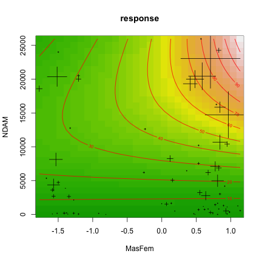

Hurricanes
========================================================

Reanalysis of Jung, K.; Shavitt, S.; Viswanathan, M. & Hilbe, J. M. (2014) Female hurricanes are deadlier than male hurricanes. PNAS, in press.

By Florian Hartig, http://florianhartig.wordpress.com/

Heavily based on previous work by Bob O'Hara, from whom forked this repository

See Bob's and GrrlScientist's conclusions at http://www.theguardian.com/science/grrlscientist/2014/jun/04/hurricane-gender-name-bias-sexism-statistics

Loading the data


```r
# rm(list=ls(all=TRUE))

library(gdata)
library(mgcv)
library(MASS)
library(MuMIn)

# Read in the data / I took this one from Bob
Data = read.xls("http://www.pnas.org/content/suppl/2014/05/30/1402786111.DCSupplemental/pnas.1402786111.sd01.xlsx", 
    nrows = 92, as.is = TRUE)
Data$MasFem = as.vector(scale(Data$MasFem))
# Data$NDAM = scale(Data$NDAM) I didn't scale NDAM, which I would usually
# have done because of the interaction because I want to sqrt it later hope
# it's fine the MasFem scaled
```


Fit of the full model used in paper with mgcv; creating all model supsets and comparing AICc shows the data supports this model complexity


```r
originalModelGAM = gam(alldeaths ~ MasFem * (Minpressure_Updated.2014 + NDAM), 
    data = Data, family = negbin(theta = c(0.2, 10)), na.action = "na.fail")
summary(originalModelGAM)
```

```
## 
## Family: Negative Binomial(0.786) 
## Link function: log 
## 
## Formula:
## alldeaths ~ MasFem * (Minpressure_Updated.2014 + NDAM)
## 
## Parametric coefficients:
##                                  Estimate Std. Error z value Pr(>|z|)    
## (Intercept)                      2.95e+01   7.80e+00    3.78  0.00016 ***
## MasFem                          -1.93e+01   7.93e+00   -2.43  0.01504 *  
## Minpressure_Updated.2014        -2.85e-02   8.04e-03   -3.54  0.00040 ***
## NDAM                             6.95e-05   1.14e-05    6.11  1.0e-09 ***
## MasFem:Minpressure_Updated.2014  1.97e-02   8.16e-03    2.42  0.01569 *  
## MasFem:NDAM                      5.13e-05   1.17e-05    4.37  1.3e-05 ***
## ---
## Signif. codes:  0 '***' 0.001 '**' 0.01 '*' 0.05 '.' 0.1 ' ' 1
## 
## 
## R-sq.(adj) =  -3.51e+03   Deviance explained = 42.8%
## UBRE score = 0.24794  Scale est. = 1         n = 92
```

```r
# gam.check(originalModelGAM)
print(dredge(originalModelGAM)[1:5])
```

```
## Global model call: gam(formula = alldeaths ~ MasFem * (Minpressure_Updated.2014 + 
##     NDAM), family = negbin(theta = c(0.2, 10)), data = Data, 
##     na.action = "na.fail")
## ---
## Model selection table 
##     (Int)      MsF Mnp_Upd.2014       NDA MsF:Mnp_Upd.2014   MsF:NDA df
## 32 29.460 -19.2700     -0.02846 6.949e-05          0.01971 5.126e-05  6
## 24 21.010  -0.1326     -0.01980 8.353e-05                  3.391e-05  5
## 7  17.030              -0.01567 8.754e-05                             3
## 8  17.580   0.1123     -0.01622 8.432e-05                             4
## 5   1.856                       1.003e-04                             2
##    logLik  AICc delta weight
## 32 -323.4 659.7  0.00  0.595
## 24 -325.7 662.1  2.37  0.182
## 7  -328.3 662.8  3.09  0.127
## 8  -327.9 664.2  4.50  0.063
## 5  -330.7 665.5  5.76  0.033
```


I wanted to see how the results of mgcv compare to glm.mb in MASS


```r
originalModelGLMNB <- glm.nb(alldeaths ~ MasFem * (Minpressure_Updated.2014 + 
    NDAM), data = Data, na.action = "na.fail")
summary(originalModelGLMNB)
```

```
## 
## Call:
## glm.nb(formula = alldeaths ~ MasFem * (Minpressure_Updated.2014 + 
##     NDAM), data = Data, na.action = "na.fail", init.theta = 0.7867893996, 
##     link = log)
## 
## Deviance Residuals: 
##    Min      1Q  Median      3Q     Max  
## -2.496  -1.044  -0.478   0.265   2.601  
## 
## Coefficients:
##                                  Estimate Std. Error z value Pr(>|z|)    
## (Intercept)                      2.95e+01   7.79e+00    3.78  0.00016 ***
## MasFem                          -1.93e+01   7.92e+00   -2.43  0.01500 *  
## Minpressure_Updated.2014        -2.85e-02   8.03e-03   -3.54  0.00040 ***
## NDAM                             6.95e-05   1.14e-05    6.11  9.9e-10 ***
## MasFem:Minpressure_Updated.2014  1.97e-02   8.15e-03    2.42  0.01564 *  
## MasFem:NDAM                      5.13e-05   1.17e-05    4.37  1.3e-05 ***
## ---
## Signif. codes:  0 '***' 0.001 '**' 0.01 '*' 0.05 '.' 0.1 ' ' 1
## 
## (Dispersion parameter for Negative Binomial(0.7868) family taken to be 1)
## 
##     Null deviance: 180.03  on 91  degrees of freedom
## Residual deviance: 102.90  on 86  degrees of freedom
## AIC: 660.7
## 
## Number of Fisher Scoring iterations: 1
## 
## 
##               Theta:  0.787 
##           Std. Err.:  0.120 
## 
##  2 x log-likelihood:  -646.736
```

```r
# gam.check(originalModelGLMNB)
print(dredge(originalModelGLMNB)[1:5])
```

```
## Global model call: glm.nb(formula = alldeaths ~ MasFem * (Minpressure_Updated.2014 + 
##     NDAM), data = Data, na.action = "na.fail", init.theta = 0.7867893996, 
##     link = log)
## ---
## Model selection table 
##     (Int)      MsF Mnp_Upd.2014       NDA MsF:Mnp_Upd.2014   MsF:NDA df
## 32 29.450 -19.2700     -0.02845 6.949e-05          0.01971 5.125e-05  7
## 24 21.010  -0.1327     -0.01980 8.354e-05                  3.391e-05  6
## 7  17.030              -0.01568 8.754e-05                             4
## 8  17.580   0.1123     -0.01622 8.433e-05                             5
## 5   1.856                       1.003e-04                             3
##    logLik  AICc delta weight
## 32 -323.4 662.1  0.00  0.582
## 24 -325.7 664.4  2.31  0.183
## 7  -328.3 665.0  2.93  0.135
## 8  -327.9 666.5  4.40  0.065
## 5  -330.7 667.6  5.55  0.036
```


Seems the parameters are identical, but AICc isn't quite, no idea why. Also, the parameters seem different from those reported in the paper. Also here the reason is not quite clear to me, they be doing something different. The parameters that are isolated as significant are identical though. 

As the model selection ranks the full model as best, one is tempted to add more parameters, specially when noting the problems in the residuals that I won't plot again here as they were already discussed by Bob and GrrlScientist. So, let's add quadratic and sqrt effects and do the model selection again 


```r
LargerModel = gam(alldeaths ~ MasFem * (Minpressure_Updated.2014 + sqrt(NDAM) + 
    NDAM + I(NDAM^2)), data = Data, family = negbin(theta = c(0.2, 10)), na.action = "na.fail")
# gam.check(LargerModel)
summary(LargerModel)
```

```
## 
## Family: Negative Binomial(1.159) 
## Link function: log 
## 
## Formula:
## alldeaths ~ MasFem * (Minpressure_Updated.2014 + sqrt(NDAM) + 
##     NDAM + I(NDAM^2))
## 
## Parametric coefficients:
##                                  Estimate Std. Error z value Pr(>|z|)    
## (Intercept)                     -3.62e-01   8.79e+00   -0.04   0.9672    
## MasFem                           5.37e+00   9.17e+00    0.58   0.5586    
## Minpressure_Updated.2014         6.07e-04   8.89e-03    0.07   0.9456    
## sqrt(NDAM)                       5.47e-02   1.18e-02    4.64  3.4e-06 ***
## NDAM                            -2.23e-04   8.24e-05   -2.70   0.0068 ** 
## I(NDAM^2)                        1.15e-09   6.86e-10    1.68   0.0929 .  
## MasFem:Minpressure_Updated.2014 -5.43e-03   9.26e-03   -0.59   0.5577    
## MasFem:sqrt(NDAM)               -8.32e-03   1.23e-02   -0.68   0.4988    
## MasFem:NDAM                      8.91e-05   8.60e-05    1.04   0.3001    
## MasFem:I(NDAM^2)                -8.62e-10   7.29e-10   -1.18   0.2371    
## ---
## Signif. codes:  0 '***' 0.001 '**' 0.01 '*' 0.05 '.' 0.1 ' ' 1
## 
## 
## R-sq.(adj) =  0.369   Deviance explained = 59.8%
## UBRE score = 0.31286  Scale est. = 1         n = 92
```

```r
print(dredge(LargerModel)[1:10])
```

```
## Global model call: gam(formula = alldeaths ~ MasFem * (Minpressure_Updated.2014 + 
##     sqrt(NDAM) + NDAM + I(NDAM^2)), family = negbin(theta = c(0.2, 
##     10)), data = Data, na.action = "na.fail")
## ---
## Model selection table 
##      (Int)       MsF Mnp_Upd.2014        NDA     NDA^2 sqr(NDA)   MsF:NDA
## 21  0.5233                        -9.185e-05            0.03919          
## 29  0.2767                        -2.018e-04 9.335e-10  0.05246          
## 22  0.5310  0.080100              -9.148e-05            0.03897          
## 150 0.5323 -0.095690              -9.140e-05            0.03885          
## 158 0.2693 -0.099700              -2.094e-04 1.024e-09  0.05299          
## 30  0.2826  0.085470              -2.028e-04 9.480e-10  0.05236          
## 23  3.4980              -0.003031 -8.950e-05            0.03808          
## 86  0.5327  0.005771              -9.114e-05            0.03884 9.463e-06
## 31  2.1760              -0.001930 -1.983e-04 9.153e-10  0.05150          
## 94  0.2886  0.009197              -2.014e-04 9.588e-10  0.05202 9.493e-06
##     MsF:sqr(NDA) df logLik  AICc delta weight
## 21                3 -310.1 626.6  0.00  0.209
## 29                4 -309.2 626.8  0.24  0.185
## 22                4 -309.9 628.2  1.65  0.091
## 150     0.002621  5 -308.8 628.3  1.76  0.086
## 158     0.002722  6 -307.7 628.4  1.82  0.084
## 30                5 -308.9 628.4  1.87  0.082
## 23                4 -310.0 628.6  1.98  0.077
## 86                5 -309.1 628.9  2.29  0.066
## 31                5 -309.1 629.0  2.39  0.063
## 94                6 -308.1 629.2  2.65  0.055
```


Note that the highest-ranked model has actually lower DF (only) than the full model from the paper, and still a much better fit; and all the good models include nonlinear terms. Clearly, a nonlinear term in NDAM is needed. 

The best model doesn't include femininity, but within a Delta AICc of 2 there are quite a few models that have femininity still in. I would thus say that Bob is definitely right about the nonlinear term, and the absense of the nonlinear term was probably compensated by adding effects on the interactions and thus overstimating the effects of femininity. However, accounting for that, there might still be a small effect of MasFem. The AICc is in the possible range, and the estimates are consistently around 0.05.

This gets even more likely when we exlude furter outliers. It was pointed out by some commentators that a few hurricanes with very large damage may bias the analysis. If we removed the ~3 points with sqrt(NDAM) > 200, we get similar results, but the models with femininity included are even closer to the best model (Delta AICc of 0.24 for the best model with femininity, which is basically as good as the best model).


```r
LargerModelOutlier = gam(alldeaths ~ MasFem * (Minpressure_Updated.2014 + sqrt(NDAM) + 
    NDAM + I(NDAM^2)), data = Data[sqrt(Data$NDAM) < 200, ], family = negbin(theta = c(0.2, 
    10)), na.action = "na.fail")
summary(LargerModelOutlier)
```

```
## 
## Family: Negative Binomial(1.123) 
## Link function: log 
## 
## Formula:
## alldeaths ~ MasFem * (Minpressure_Updated.2014 + sqrt(NDAM) + 
##     NDAM + I(NDAM^2))
## 
## Parametric coefficients:
##                                  Estimate Std. Error z value Pr(>|z|)  
## (Intercept)                      1.45e+00   9.30e+00    0.16    0.876  
## MasFem                           7.21e+00   9.51e+00    0.76    0.448  
## Minpressure_Updated.2014        -1.11e-03   9.38e-03   -0.12    0.906  
## sqrt(NDAM)                       4.68e-02   2.02e-02    2.31    0.021 *
## NDAM                            -1.45e-04   2.22e-04   -0.65    0.513  
## I(NDAM^2)                       -2.19e-10   5.10e-09   -0.04    0.966  
## MasFem:Minpressure_Updated.2014 -7.14e-03   9.59e-03   -0.74    0.457  
## MasFem:sqrt(NDAM)               -2.12e-02   2.02e-02   -1.05    0.294  
## MasFem:NDAM                      2.41e-04   2.32e-04    1.04    0.300  
## MasFem:I(NDAM^2)                -4.36e-09   5.62e-09   -0.78    0.438  
## ---
## Signif. codes:  0 '***' 0.001 '**' 0.01 '*' 0.05 '.' 0.1 ' ' 1
## 
## 
## R-sq.(adj) =  0.339   Deviance explained = 57.6%
## UBRE score = 0.31799  Scale est. = 1         n = 89
```

```r
print(dredge(LargerModelOutlier)[1:10])
```

```
## Global model call: gam(formula = alldeaths ~ MasFem * (Minpressure_Updated.2014 + 
##     sqrt(NDAM) + NDAM + I(NDAM^2)), family = negbin(theta = c(0.2, 
##     10)), data = Data[sqrt(Data$NDAM) < 200, ], na.action = "na.fail")
## ---
## Model selection table 
##      (Int)      MsF Mnp_Upd.2014        NDA      NDA^2 sqr(NDA)   MsF:NDA
## 21  0.3439                       -0.0001522             0.04794          
## 86  0.3341 -0.08935              -0.0001610             0.04874 2.861e-05
## 25  0.5271                                  -3.468e-09  0.03524          
## 282 0.5197 -0.03425                         -3.757e-09  0.03556          
## 150 0.3177 -0.16580              -0.0001650             0.04941          
## 22  0.3470  0.08015              -0.0001536             0.04795          
## 154 0.5172 -0.15170                         -3.772e-09  0.03565          
## 23  3.3220             -0.003029 -0.0001482             0.04659          
## 29  0.3052                       -0.0001907  9.577e-10  0.05092          
## 27  5.6880             -0.005271            -3.464e-09  0.03390          
##     MsF:sqr(NDA) I(NDA^2):MsF df logLik  AICc delta weight
## 21                             3 -293.0 592.2  0.00  0.172
## 86                             5 -290.9 592.4  0.24  0.153
## 25                             3 -293.3 592.8  0.65  0.124
## 282                 1.358e-09  5 -291.1 592.9  0.69  0.122
## 150     0.004055               5 -291.2 593.1  0.95  0.107
## 22                             4 -292.7 593.9  1.69  0.074
## 154     0.003908               5 -291.7 594.1  1.86  0.068
## 23                             4 -292.9 594.2  1.99  0.064
## 29                             4 -292.9 594.4  2.16  0.058
## 27                             4 -293.0 594.4  2.21  0.057
```


So, not to make a suggestion that this is the correct model, but just to see how a best-case scenario for femininity would look like, I'm taking model 2 with the outlier-removed data that inlcuded femininity with a Delta AIC of 0.24, and plot the effects. 


```r
possibleModel = gam(alldeaths ~ MasFem * NDAM + sqrt(NDAM), data = Data[sqrt(Data$NDAM) < 
    200, ], family = negbin(theta = c(0.2, 10)), na.action = "na.fail")
summary(possibleModel)
```

```
## 
## Family: Negative Binomial(1.113) 
## Link function: log 
## 
## Formula:
## alldeaths ~ MasFem * NDAM + sqrt(NDAM)
## 
## Parametric coefficients:
##              Estimate Std. Error z value Pr(>|z|)    
## (Intercept)  3.34e-01   2.59e-01    1.29   0.1967    
## MasFem      -8.93e-02   1.43e-01   -0.63   0.5316    
## NDAM        -1.61e-04   5.65e-05   -2.85   0.0044 ** 
## sqrt(NDAM)   4.87e-02   8.88e-03    5.49    4e-08 ***
## MasFem:NDAM  2.86e-05   1.45e-05    1.97   0.0491 *  
## ---
## Signif. codes:  0 '***' 0.001 '**' 0.01 '*' 0.05 '.' 0.1 ' ' 1
## 
## 
## R-sq.(adj) =  0.356   Deviance explained = 57.1%
## UBRE score = 0.21025  Scale est. = 1         n = 89
```

```r
# gam.check(possibleModel)
AICc(possibleModel)
```

```
## [1] 592.4
```


Plotting the predictions of this model for MasFem and NDAM shows that there is a substantial effect of femininity for higher damage values (crosses are the data values, size of the crosses is proportional to fatalities)


```r
vis.gam(possibleModel, view = c("MasFem", "NDAM"), plot.type = "contour", color = "terrain", 
    type = "response")
points(Data$MasFem, Data$NDAM, cex = Data$alldeaths/20, pch = 3)
```

 


It should be noted that all this depends on a few data points, and most of them are located in the low-damage area. So, my gut feeling is that reported uncertainty (that I didn't plot) is still overconfident in the high-damage area, so I wouldn't trust any model to be right in this area based on these few data points. 

Final conclusion: it is possible, but unproven that femininity has an influence on fatalities. IF we want to believe this, the model above would be a plausible model, and IF we believe that this model can be trusted in the high NDAM area where we have FEW data points, then it would look as if femininity has a practically relevant impact on fatalites. 

Many, maybe too many IFs ...   


